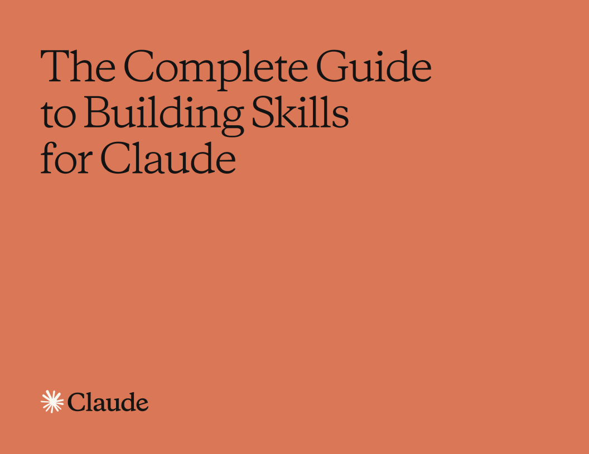

# Claude를 위한 스킬 만들기 완전 가이드 (한국어 번역)

> **The Complete Guide to Building Skills for Claude** 의 **비공식 한국어 번역본**입니다.

## 소개

이 레포지토리는 Anthropic이 발행한 **"The Complete Guide to Building Skills for Claude"** PDF 문서를 한국어로 번역한 마크다운 파일을 포함합니다.

## 목차

| # | 파일 | 내용 |
|---|------|------|
| 0 | [소개](chapters/00-소개.md) | 표지, 목차, 소개 |
| 1 | [기초](chapters/01-기초.md) | 스킬이란, 핵심 설계 원칙, Skills + MCP |
| 2 | [기획 및 설계](chapters/02-기획-및-설계.md) | 유스케이스 정의, 기술 요구사항, YAML 프론트매터, 지침 작성 |
| 3 | [테스트와 반복 개선](chapters/03-테스트와-반복-개선.md) | 트리거/기능/성능 테스트, skill-creator, 피드백 기반 개선 |
| 4 | [배포 및 공유](chapters/04-배포-및-공유.md) | 배포 모델, API 사용, 스킬 포지셔닝 |
| 5 | [패턴과 문제 해결](chapters/05-패턴과-문제-해결.md) | 5가지 스킬 패턴, 트러블슈팅 가이드 |
| 6 | [리소스 및 참고자료](chapters/06-리소스-및-참고자료.md) | 공식 문서, 예시 스킬, 도구, 지원 |
| A | [빠른 체크리스트](chapters/A-빠른-체크리스트.md) | 시작 전 / 개발 중 / 업로드 전후 체크리스트 |
| B | [YAML 프론트매터](chapters/B-YAML-프론트매터.md) | 필수/선택 필드, 보안 참고사항 |
| C | [완전한 스킬 예시](chapters/C-완전한-스킬-예시.md) | 프로덕션 레벨 스킬 예시 링크 |

## 원본 출처

- **원문**: [The Complete Guide to Building Skills for Claude.pdf](https://resources.anthropic.com/hubfs/The-Complete-Guide-to-Building-Skill-for-Claude.pdf) (Anthropic)
- **공식 스킬 문서**: https://platform.claude.com/docs/ko/agents-and-tools/agent-skills/overview
- **예시 스킬 레포**: https://github.com/anthropics/skills

## 라이선스

이 번역본은 개인적인 교육 목적으로 제작되었습니다. 원본 저작권은 [Anthropic](https://www.anthropic.com/)에 있습니다.
