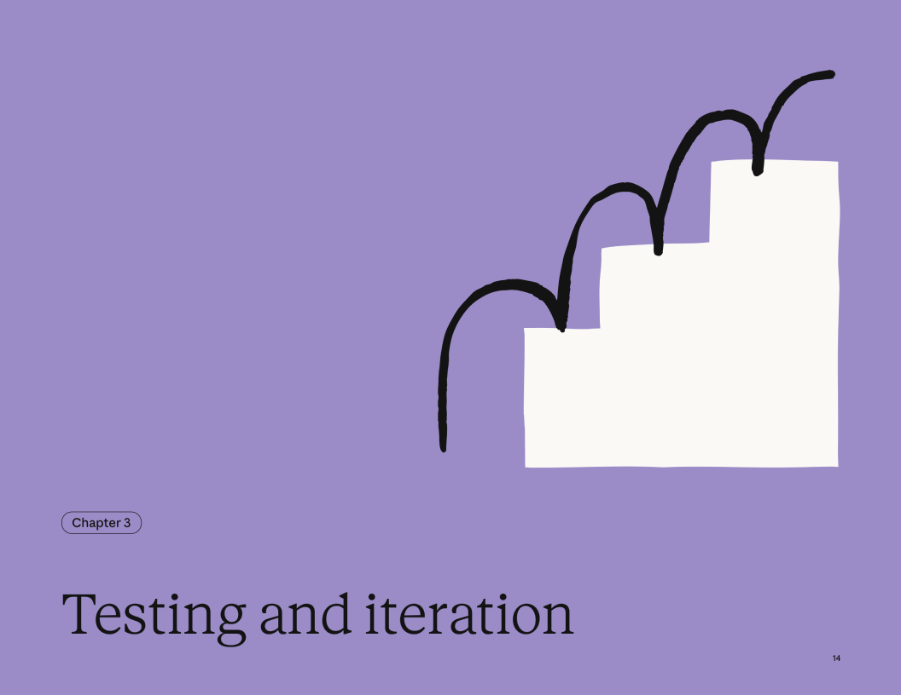

# 3장 테스트와 반복 개선

스킬은 필요 수준에 따라 다양한 엄격도로 테스트할 수 있습니다.

- **Claude.ai에서 수동 테스트**: 직접 질의를 던지고 동작을 관찰. 빠른 반복, 셋업 불필요.
- **Claude Code에서 스크립트 테스트**: 변경에 대해 반복 가능한 검증을 위해 테스트 케이스 자동화.
- **Skills API로 프로그램 테스트**: 정의된 테스트 세트에 대해 체계적으로 평가 스위트를 실행.

스킬의 품질 요구사항과 노출 범위에 맞는 방법을 고르세요. 소규모 팀 내부 스킬과 수천 명이 쓰는 엔터프라이즈 스킬은 테스트 요구가 다릅니다.

```markdown
 **팁(Pro Tip)**: 한 가지 작업을 성공시킨 뒤 확장하기
```

가장 효과적인 스킬 제작자는, Claude가 성공할 때까지 **하나의 까다로운 작업**을 반복 개선한 뒤, 그 접근을 스킬로 추출합니다. 이는 Claude의 in-context learning을 활용하며, 광범위 테스트보다 빠르게 신호를 얻을 수 있습니다. 기반이 잡히면 여러 테스트 케이스로 확장해 커버리지를 확보하세요.

## 권장 테스트 접근(Recommended Testing Approach)

초기 경험상, 효과적인 스킬 테스트는 보통 아래 **3가지**를 포함합니다.

### 1) 트리거 테스트(Triggering tests)

**목표(Goal):** 스킬이 적절한 시점에 로드되는지 확인

**테스트 케이스:**
- ✅ 명확한 작업 요청에서 트리거됨
- ✅ 바꿔 말한 요청(패러프레이즈)에서도 트리거됨
- ❌ 관련 없는 주제에서는 트리거되지 않음
```
예시 테스트 세트(Example test suite):

트리거되어야 함(Should trigger):
- "ProjectHub 워크스페이스 새로 세팅해줘"
- "ProjectHub에 프로젝트 만들어야 해"
- "Q4 계획용 ProjectHub 프로젝트 초기화해줘"

트리거되면 안 됨(Should NOT trigger):
- "샌프란시스코 날씨 알려줘"
- "파이썬 코드 작성 좀 도와줘"
- "스프레드시트 만들어줘" (단, ProjectHub 스킬이 스프레드시트를 다룬다면 예외)
```

### 2) 기능 테스트(Functional tests)

**목표(Goal):** 스킬이 올바른 출력을 생성하는지 확인

**테스트 케이스:**
- 유효한 출력이 생성됨
- API 호출이 성공함
- 에러 핸들링이 동작함
- 엣지 케이스가 커버됨

**예시:**
```
테스트: 태스크 5개를 포함해 프로젝트 생성
Given: 프로젝트 이름 "Q4 Planning", 태스크 설명 5개
When: 스킬이 워크플로를 실행
Then:
- ProjectHub에 프로젝트가 생성됨
- 올바른 속성으로 태스크 5개가 생성됨
- 모든 태스크가 프로젝트에 연결됨
- API 에러가 없음
```

### 3) 성능 비교(Performance comparison)

**목표(Goal):** 스킬이 기본 대비 개선을 만든다는 것을 증명

`성공 기준 정의하기(Define success criteria)`의 지표를 사용해 비교하세요.

**비교 예시:**
```
스킬 없이(Without skill):
- 사용자가 매번 절차를 설명해야 함
- 15번의 왕복 대화
- 재시도가 필요한 API 호출 실패 3회
- 토큰 12,000 소비

스킬 사용(With skill):
- 워크플로 자동 실행
- 확인 질문 2개만 발생
- 실패한 API 호출 0회
- 토큰 6,000 소비
```

## skill-creator 스킬 사용하기

`skill-creator` 스킬(Claude.ai의 플러그인 디렉터리로 제공되거나, Claude Code용으로 다운로드 가능)은 **스킬을 만들고 반복 개선**하는 데 도움을 줍니다.
이미 MCP 서버가 있고 핵심 워크플로 2~3개를 알고 있다면, 보통 한 세션(대략 15~30분) 안에 **동작하는 스킬을 만들고 테스트**할 수 있습니다.

### 스킬 생성(Creating skills)
- 자연어 설명에서 스킬 초안 생성
- 프론트매터(frontmatter)를 포함한 올바른 `SKILL.md` 포맷 생성
- 트리거 문구와 문서 구조 제안

### 스킬 리뷰(Reviewing skills)
- 흔한 문제(모호한 description, 트리거 누락, 구조 문제) 플래그
- 과(over)/소(under) 트리거 위험 식별
- 스킬 목적에 맞는 테스트 케이스 제안

### 반복 개선(Iterative improvement)
- 스킬 사용 중 만난 엣지 케이스/실패 사례를 다시 가져와 개선에 활용
- 예: "이 대화에서 확인한 이슈/해결책을 반영해 [특정 엣지 케이스]를 더 잘 처리하도록 스킬을 개선해줘"

**사용 예시(To use):**

```yaml
"skill-creator로 [원하는 유스케이스]용 스킬을 만드는 걸 도와줘"
```

참고: skill-creator는 스킬의 **설계/정제**를 돕지만, 자동 테스트 스위트를 실행하거나 정량 평가 결과를 자동으로 생성하진 않습니다.

## 피드백 기반 반복 개선(Iteration based on feedback)

스킬은 "살아있는 문서"입니다. 아래 신호를 관찰하고 계속 다듬으세요.

### 소 트리거(Undertriggering) 신호
- 스킬이 로드돼야 할 때 로드되지 않음
- 사용자가 수동으로 스킬을 켬
- "언제 써야 하죠?" 같은 지원 문의 증가

```md
**해결 방법:** description에 더 많은 디테일과 뉘앙스를 추가하세요(특히 사용자가 실제로 쓰는 표현/키워드).
```

### 과 트리거(Overtriggering) 신호
- 무관한 질의에도 스킬이 로드됨
- 사용자가 스킬을 끔
- 목적 혼란이 생김

```md
**해결 방법:** 부정 트리거(negative trigger) 문장을 추가하고 description 범위를 더 구체화하세요.
```

### 실행 이슈(Execution issues)
- 결과가 일관되지 않음
- API 호출 실패
- 사용자 수정이 필요함

```md
**해결 방법:** 지침을 보강하고, 에러 핸들링을 추가하세요.
```
---
