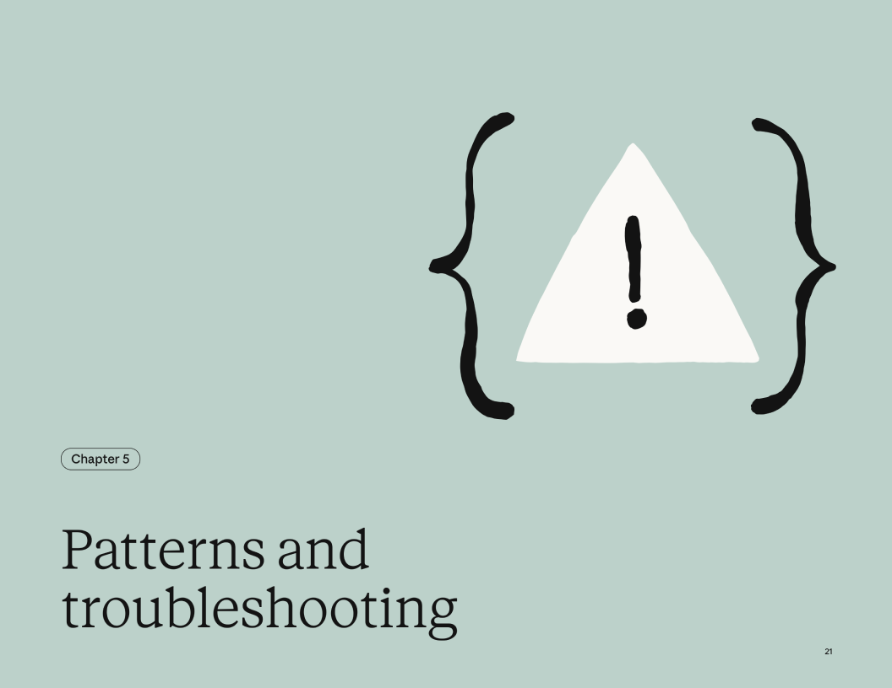

# 5장 패턴과 문제 해결

이 패턴들은 얼리어답터와 클로드 내부 팀이 만든 스킬에서 나타난 것들입니다. "규범적인 템플릿"이 아니라, 잘 동작하는 공통 접근법입니다.

## 접근 방식 선택: 문제 중심(Problem-first) vs 도구 중심(tool-first)

Home Depot 비유로 생각해보세요. "주방 캐비닛을 고쳐야 해요"라고 말하며 문제를 안고 매장에 들어가면 직원이 적절한 도구를 알려줄 겁니다. 또는 새 드릴을 고르고 특정 작업에 어떻게 사용하는지 물어볼 수도 있겠죠.

스킬도 이와 같습니다.

- **문제 중심(Problem-first):** "프로젝트 워크스페이스를 세팅해야 해" → 스킬이 올바른 MCP 호출을 올바른 순서로 오케스트레이션. 사용자는 결과를 말하고, 스킬이 도구를 처리합니다.
- **도구 중심(tool-first):** "Notion MCP를 연결해뒀어" → 스킬이 최적 워크플로/모범 사례를 Claude에게 가르칩니다. 사용자는 접근 권한이 있고, 스킬이 전문성을 제공합니다.

대부분의 스킬은 한쪽으로 기웁니다. 어떤 프레이밍이 맞는지 알면 아래 패턴 중 적절한 것을 고르기 쉬워집니다.

## 패턴 1: 순차 워크플로 오케스트레이션(Sequential workflow orchestration)

**사용 시점**: 특정 순서로 진행해야 하는 다단계 프로세스가 필요할 때

**구조 예시:**
```yaml
### 워크플로: 신규 고객 온보딩(Onboard New Customer)
#### 1단계: 계정 생성(Create Account)
MCP 도구 호출: `create_customer`
파라미터: name, email, company

#### 2단계: 결제 수단 설정(Setup Payment)
MCP 도구 호출: `setup_payment_method`
대기 조건: payment method verification

#### 3단계: 구독 생성(Create Subscription)
MCP 도구 호출: `create_subscription`
파라미터: plan_id, customer_id (1단계에서 받은 값)

#### 4단계: 환영 이메일 발송(Send Welcome Email)
MCP 도구 호출: `send_email`
템플릿: welcome_email_template
```
**핵심 기법:**
- 단계 순서를 명시
- 단계 간 의존성 표현
- 각 단계에서 검증
- 실패 시 롤백 지침

## 패턴 2: 멀티 MCP 조정(Multi-MCP coordination)

**사용 시점**: 워크플로가 여러 서비스에 걸칠 때

**예시: 디자인-개발 핸드오프(Design-to-development handoff)**
```yaml
### 1단계: 디자인 내보내기(Design Export) — Figma MCP
1. Figma에서 디자인 자산 내보내기
2. 디자인 스펙 생성
3. 자산 매니페스트 생성

### 2단계: 자산 저장(Asset Storage) — Drive MCP
1. Drive에 프로젝트 폴더 생성
2. 모든 자산 업로드
3. 공유 가능한 링크 생성

### 3단계: 태스크 생성(Task Creation) — Linear MCP
1. 개발 태스크 생성
2. 태스크에 자산 링크 첨부
3. 엔지니어링 팀에 할당

### 4단계: 알림(Notification) — Slack MCP
1. #engineering 채널에 핸드오프 요약 게시
2. 자산 링크와 태스크 참조 포함

핵심 기법:
- 명확한 단계 분리
- MCP 간 데이터 전달
- 다음 단계 이동 전 검증
- 중앙집중식 에러 핸들링

## 패턴 3: 반복 정제(Iterative refinement)

언제 쓰나: 반복할수록 출력 품질이 좋아질 때

예시: 리포트 생성(Report generation)

### 반복적 리포트 생성(Iterative Report Creation)
#### 초안 생성(Initial Draft)
1. MCP를 통해 데이터 가져오기
2. 초안 리포트 생성
3. 임시 파일에 저장

#### 품질 점검(Quality Check)
1. 검증 스크립트 실행: `scripts/check_report.py`
2. 문제점 식별:
   - 누락된 섹션
   - 일관성 없는 서식
   - 데이터 검증 에러

#### 개선 루프(Refinement Loop)
1. 식별된 문제를 각각 해결
2. 영향받는 섹션 재생성
3. 재검증
4. 품질 기준 충족 시까지 반복

#### 최종화(Finalization)
1. 최종 서식 적용
2. 요약 생성
3. 최종 버전 저장

핵심 기법:
- 명확한 품질 기준
- 반복적 개선
- 검증 스크립트 활용
- 반복 중단 시점 판단
```

## 패턴 4: 컨텍스트 기반 도구 선택(Context-aware tool selection)

**사용 시점** : 같은 결과라도 상황에 따라 다른 도구를 써야 할 때

**예시: 파일 저장(File storage)**

```yaml
### 스마트 파일 저장(Smart File Storage)
#### 의사결정 트리(Decision Tree)
1. 파일 타입과 크기 확인
2. 최적의 저장 위치 결정:
   - 대용량 파일(>10MB): 클라우드 스토리지 MCP 사용
   - 협업 문서: Notion/Docs MCP 사용
   - 코드 파일: GitHub MCP 사용
   - 임시 파일: 로컬 스토리지 사용

#### 저장 실행(Execute Storage)
결정에 따라:
- 적절한 MCP 도구 호출
- 서비스별 메타데이터 적용
- 접근 링크 생성

#### 사용자에게 맥락 제공(Provide Context to User)
해당 저장소를 선택한 이유를 설명
```
**핵심 기법:**
- 명확한 의사결정 기준
- 대안(폴백) 옵션
- 선택의 투명성

## 패턴 5: 도메인 특화 지능(Domain-specific intelligence)

**사용 시점:** 스킬이 단순 도구 접근을 넘어, 전문 지식을 더해줄 때

**예시:** 금융 컴플라이언스(Financial compliance)

### 컴플라이언스를 포함한 결제 처리(Payment Processing with Compliance)
```yaml
#### 처리 전(컴플라이언스 체크)
1. MCP를 통해 거래 상세 정보 가져오기
2. 컴플라이언스 규칙 적용:
   - 제재 목록 확인
   - 관할 지역 허용 여부 검증
   - 위험 수준 평가
3. 컴플라이언스 결정 문서화

#### 처리(Processing)
컴플라이언스 통과 시:
  - 결제 처리 MCP 도구 호출
  - 적절한 사기 방지 검사 적용
  - 거래 처리
그렇지 않을 시:
  - 검토 대상으로 플래그
  - 컴플라이언스 케이스 생성

#### 감사 추적(Audit Trail)
- 모든 컴플라이언스 검사 기록
- 처리 결정 기록
- 감사 보고서 생성
```
**핵심 기법:**
- 로직에 도메인 전문성을 내장
- 처리 전 컴플라이언스 확인
- 포괄적 문서화
- 명확한 거버넌스

---

## 문제 해결(Troubleshooting)

### 스킬이 업로드되지 않음(Skill won't upload)

#### **에러:** "업로드한 폴더에서 SKILL.md를 찾을 수 없습니다" (원문: Could not find SKILL.md in uploaded folder)
**원인:** 파일명이 정확히 SKILL.md가 아님
**해결:**
- SKILL.md로 이름 변경 (대소문자 구분)
- 확인 방법: `ls -la` 실행 시 SKILL.md가 보여야 합니다.

#### **에러:** "Invalid frontmatter"
**원인:** YAML 서식 문제
**흔한 실수:**

```yaml
# 잘못됨 - 구분자(delimiter) 누락
name: my-skill
description: Does things

# 잘못됨 - 따옴표가 닫히지 않음
name: my-skill
description: "Does things

# 올바름
---
name: my-skill
description: Does things
---
```

#### **에러:** "Invalid skill name"
**원인:** 이름에 공백이나 대문자가 포함됨

```yaml
# 잘못됨
name: My Cool Skill

# 올바름
name: my-cool-skill
```

### 스킬이 트리거되지 않음(Skill doesn't trigger)

**증상:** 스킬이 자동으로 로드되지 않음
**해결:** description 필드를 수정하세요(좋은/나쁜 예시 참고)

**빠른 체크리스트:**
- 너무 일반적인가? ("Helps with projects" 같은 문구는 동작하지 않음)
- 사용자가 실제로 말할 법한 트리거 문구가 포함되어 있나?
- 필요하다면 관련 파일 타입을 언급하고 있나?

**디버깅 접근법:**
Claude에게 물어보기: "[skill name] 스킬은 언제 사용하나요?" Claude가 description을 인용해 답합니다. 빠진 점을 기준으로 description을 수정하세요.

### 스킬이 너무 자주 트리거됨(Skill triggers too often)

**증상:** 관련 없는 질의에도 스킬이 로드됨

**해결책:**

**1. 부정 트리거 추가**

```yaml
description: Advanced data analysis for CSV files. Use for
statistical modeling, regression, clustering. Do NOT use for
simple data exploration (use data-viz skill instead).
```

**2. 더 구체적으로 작성**

```yaml
# 너무 광범위
description: Processes documents

# 더 구체적
description: Processes PDF legal documents for contract review
```

**3. 범위 명확화**

```yaml
description: PayFlow payment processing for e-commerce. Use
specifically for online payment workflows, not for general
financial queries.
```

### MCP 연결 이슈(MCP connection issues)

**증상:** 스킬은 로드되지만 MCP 호출이 실패

**체크리스트:**
1. MCP 서버 연결 확인
   – Claude.ai: Settings > Extensions > [Your Service]
   – "Connected" 상태가 표시되어야 합니다
2. 인증 확인
   – API 키가 유효하고 만료되지 않았는지 확인
   – 적절한 권한/스코프가 부여되었는지 확인
   – OAuth 토큰이 갱신되었는지 확인
3. MCP 독립적으로 테스트
   – Claude에게 스킬 없이 MCP를 직접 호출해보라고 요청
   – "Use [Service] MCP to fetch my projects"
   – 이것도 실패하면 문제는 스킬이 아니라 MCP 쪽입니다
4. 도구명 확인
   – 스킬이 올바른 MCP 도구명을 참조하는지 확인
   – MCP 서버 문서를 확인
   – 도구명은 대소문자를 구분합니다

### 지침이 따라지지 않음(Instructions not followed)

**증상:** 스킬은 로드되지만 Claude가 지침을 따르지 않음

**일반적인 원인:**
1. **지침이 너무 장황함**
   – 지침을 간결하게 유지
   – 불릿 포인트와 번호 목록 사용
   – 상세 참고 자료는 별도 파일로 이동
2. **지침이 묻혀있음**
   – 중요한 지침을 맨 위에 배치
   – `## Important` 또는 `## Critical` 헤더를 사용
   – 필요하면 핵심 사항을 반복
3. **모호한 표현**

```yaml
# 나쁨
Make sure to validate things properly

# 좋음
CRITICAL: Before calling create_project, verify:
- Project name is non-empty
- At least one team member assigned
- Start date is not in the past
```

**고급 기법**: 중요한 검증은 언어 지침에만 의존하지 말고, 체크를 프로그램적으로 수행하는 스크립트를 함께 번들링하는 것을 고려하세요. 코드는 결정적이지만, 자연어 해석은 그렇지 않습니다. 이 패턴의 예시는 [Office 스킬](https://github.com/anthropics/skills/tree/main/skills)들을 참고하세요.

4. **모델 "게으름"** — 명시적 격려하는 표현  추가:

```yaml
## 성능 관련 메모(Performance Notes)
- 충분한 시간을 들여 꼼꼼하게 수행하세요
- 속도보다 품질이 중요합니다
- 검증 단계를 건너뛰지 마세요
```

참고: 이 내용은 SKILL.md에 넣는 것보다 사용자 프롬프트(사용자가 입력하는 말)에 포함시키는 편이 더 효과적입니다.

### 큰 컨텍스트 이슈(Large context issues)

**증상:** 스킬이 느리거나 응답 품질이 저하됨

**원인:**
- 스킬 콘텐츠가 너무 큼
- 동시에 활성화된 스킬이 너무 많음
- 점진적 공개 대신 모든 콘텐츠가 로드됨

**해결책:**

1. **SKILL.md 크기 최적화**
- 상세 문서를 `references/`로 이동
- 본문에 길게 넣지 말고 references로 링크
- SKILL.md를 5,000단어 이하로 유지
2. **활성화된 스킬 수 줄이기**
- 동시에 20~50개 이상의 스킬이 활성화되어 있는지 점검
- 선택적 활성화를 권장
- 관련 기능별 스킬 "팩(pack)"을 고려

---
